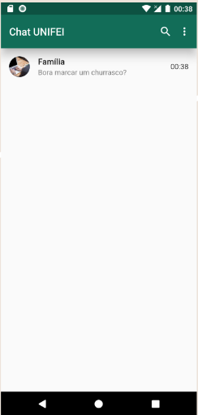

# ECOS12 - Sistema de Mensageiria

Projeto criado em parceria com o [Caio Campos](https://github.com/CamposCaio) como trabalho da matéria de Sistema Distribuído do Curso de Engenharia da Computação. No qual foi feito o uso desta [apresentação](https://docs.google.com/presentation/d/1TEsrG1A_0xCffCQnQVnSJzI5ghYC6WgVRexjNmVKnXo/edit?usp=sharing).

| | |
|:-------------------------:|:-------------------------:|
||

| | | |
|:-------------------------:|:-------------------------:|:-------------------------:|
| ||

## Tecnologias utilizadas

No desenvolvimento do projeto foi utilizado o Flutter no front-end para o desenvolvimento do [aplicativo](https://github.com/JacksonECO/chat_app_ecos12/releases) e do [site](https://ecos12-chat.web.app/). Já para o back-end foi utilizado o node.js e Sqlite3 no seu desenvolvimento, para mais detalhes acesse o repositório [CamposCaio/ecos12-chat-backend](https://github.com/CamposCaio/ecos12-chat-backend).

## Resumo

O projeto é um aplicativo de telecomunicações que permite conversas entre usuários e através de grupos. Para que isso possa ser possível se utiliza do WebSocket para as trocas de mensagens entre o servidor e os usuário envolvidos na conversa. Já para a realização do login, registro e autenticações é utilizado de uma api Rest.

Todas as mensagens e conversas existentes ficam salvas dentro de um banco de dados SQL no servidor. De maneira que sempre que o usuário conectar é enviado para ele todas as mensagens ou simplesmente as mensagens que ele recebeu enquanto estava off-line. No entanto a aplicação atualmente não esta fazendo uso de nenhum banco de dado, ou seja, sempre que o usuário conectar ele irá receber todas as suas mensagens.

Além de utilizar do modelo cliente-servidor, também fizemos o uso de uma conexão peer-to-peer híbrida para que seja possível a comunicação entre usuário de maneira totalmente anônima, onde ao invés das mensagens passagem pelo servidor elas vão diretamente de um usuário para o outro, no entanto para utilização deste recurso é preciso que ambos os usuários esteja conectados na mesma rede. Assim como no primeiro caso também utilizamos o WebSocket para troca de mensagens e este recurso apresenta algumas limitações ao utilizar o versão web.
